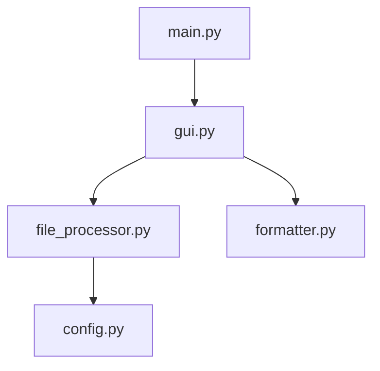

# Code2Prompt 🚀

**Code2Prompt** is a GUI-based desktop tool that transforms an entire codebase (e.g., Next.js, Python, or similar projects) into a structured, prompt-optimized format designed for language models like ChatGPT. This tool lets you customize which directories and files to ignore (e.g., `node_modules`, `.git`, etc.) and supports output in **Plaintext**, **Markdown**, or **XML** formats.

---

## Table of Contents 📚

- [Code2Prompt 🚀](#code2prompt-)
  - [Table of Contents 📚](#table-of-contents-)
  - [Features ✨](#features-)
  - [Project Structure 🗂️](#project-structure-️)
  - [Installation 🔧](#installation-)
  - [Usage 🚀](#usage-)
  - [Screenshots 📸](#screenshots-)
  - [Mermaid Diagram](#mermaid-diagram)
  - [Contributing 🤝](#contributing-)
  - [License 📄](#license-)
  - [Author 👨‍💻](#author-)
  - [How to Cite 📝](#how-to-cite-)

---

## Features ✨

- **Easy ZIP File Loading:** Upload a ZIP file containing your project source code.
- **Customizable Ignore Settings:** Choose which directories/files to ignore (e.g., `node_modules`, `.next`, etc.).
- **Multiple Output Formats:** Generate prompts in **Plaintext**, **Markdown**, or **XML**.
- **Optimized for LLMs:** Structured file boundaries and language hints for improved prompt clarity.
- **User-Friendly GUI:** Built with Tkinter for an intuitive user experience.
- **Clipboard Integration:** Copy the generated prompt directly to your clipboard.

---

## Project Structure 🗂️



- **config.py:** Contains configuration settings and default ignore directories.
- **file_processor.py:** Handles extraction of ZIP files and retrieving file paths.
- **formatter.py:** Formats file content into optimized prompts (Plaintext, Markdown, XML).
- **gui.py:** Implements the GUI using Tkinter.
- **main.py:** Entry point for launching the application.

---

## Installation 🔧

1. **Clone the Repository:**

   ```bash
   git clone https://github.com/yourusername/Code2Prompt.git
   cd Code2Prompt
   ```

2. **Create a Virtual Environment:**

   ```bash
   python -m venv venv
   source venv/bin/activate  # On Windows: venv\Scripts\activate
   ```

3. **Install Dependencies:**

   This project uses only Python's standard library. For development, you may install tools like `mypy` for type checking and `black` for formatting.

4. **Format Code (Optional):**

   Use [Black](https://black.readthedocs.io/) to format the code:

   ```bash
   black .
   ```

---

## Usage 🚀

1. **Run the Application:**

   ```bash
   python main.py
   ```

2. **Using the GUI:**
   - **Load .zip File:** Click to load a ZIP file containing your project.
   - **Ignore Settings:** Customize directories/files to ignore.
   - **Select Output Format:** Choose between Plaintext, Markdown, or XML.
   - **Generate Prompt:** Click to generate an optimized prompt.
   - **Copy to Clipboard:** Copy the generated prompt for use with your language model.

---

## Screenshots 📸

_Add screenshots or GIFs here to showcase the application UI and features._


---

## Mermaid Diagram

Below is a Mermaid diagram representing the project structure:


---

## Contributing 🤝

We welcome contributions! Please fork the repository and submit a pull request with your changes. For major changes, open an issue first to discuss what you would like to change.

---

## License 📄

This project is licensed under the MIT License. See the [LICENSE](LICENSE) file for details.

---

## Author 👨‍💻

**Bjorn Melin** - [GitHub Profile](https://github.com/BjornMelin)

---

## How to Cite 📝

If you use Code2Prompt in your research or project, please cite it using the following BibTeX entry:

```bibtex
@software{melin2025code2prompt,
  author       = {Bjorn Melin},
  title        = {Code2Prompt: A GUI Tool for Codebase-to-Prompt Conversion},
  year         = {2025},
  publisher    = {GitHub},
  journal      = {GitHub repository},
  howpublished = {\url{https://github.com/BjornMelin/Code2Prompt}}
}
```

---

Enjoy using **Code2Prompt** to supercharge your prompt engineering and optimize your AI interactions! 🎉
