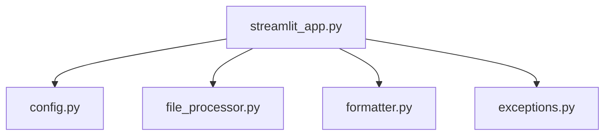

# Code2Prompt 🚀

**Code2Prompt** is a modern, web-based tool that transforms one or more ZIP files containing a codebase into a structured, prompt-optimized format for language models like ChatGPT. With a sleek, customizable Streamlit interface, you can upload ZIP files, manage ignore patterns dynamically, filter file types, and customize prompt generation with advanced options.

---

## Table of Contents 📚

- [Code2Prompt 🚀](#code2prompt-)
  - [Table of Contents 📚](#table-of-contents-)
  - [Features ✨](#features-)
  - [Project Structure 🗂️](#project-structure-️)
  - [Installation 🔧](#installation-)
  - [Usage 🚀](#usage-)
  - [Screenshots 📸](#screenshots-)
  - [Mermaid Diagram](#mermaid-diagram)
  - [Contributing 🤝](#contributing-)
  - [License 📄](#license-)
  - [Author 👨‍💻](#author-)
  - [How to Cite 📝](#how-to-cite-)

---

## Features ✨

- **Modern Streamlit Interface:**
  - Uses Streamlit's built-in theming with customizable configuration.
  - Responsive layout with a sidebar for advanced settings and progress indicators.
- **Advanced Customization Options:**
  - Dynamic ignore pattern management (including custom patterns).
  - File type filtering (select which file extensions to process).
  - Custom prompt header and options to include/exclude file boundaries, truncate content, and add file metadata.
- **Batch Processing:**
  - Upload and process multiple ZIP files simultaneously.
  - Progress bars and detailed logging for processing steps.
- **Interactive File Tree Viewer:**
  - Collapsible preview of the file tree, preserved in session state.
- **Robust Error Handling:**
  - Clear, user-friendly error messages with custom exceptions.
- **Extensible & Modular:**
  - Clean, modular codebase for future enhancements.

---

## Project Structure 🗂️



- **config.py:** Default settings for ignore directories and file type filters.
- **file_processor.py:** Handles extraction of ZIP files and retrieval of file paths.
- **formatter.py:** Formats file content into optimized prompts (Plaintext, Markdown, XML) with advanced customization.
- **exceptions.py:** Custom exceptions for robust error handling.
- **streamlit_app.py:** Main entry point with advanced UI and customization features.
- **Makefile:** Shortcut for running the app.
- **requirements.txt:** Project dependencies.

---

## Installation 🔧

1. **Clone the Repository:**

   ```bash
   git clone https://github.com/yourusername/Code2Prompt.git
   cd Code2Prompt
   ```

2. **Create a Virtual Environment:**

   ```bash
   python -m venv venv
   source venv/bin/activate  # On Windows: venv\Scripts\activate
   ```

3. **Install Dependencies:**

   ```bash
   pip install -r requirements.txt
   ```

4. **Format Code (Optional):**

   Use [Black](https://black.readthedocs.io/) to format the code:

   ```bash
   black .
   ```

---

## Usage 🚀

1. **Run the Application:**

   ```bash
   streamlit run streamlit_app.py
   ```

2. **Using the App:**
   - **Upload ZIP Files:** Upload one or more ZIP files containing your codebase.
   - **Customize Settings:** Use the sidebar to manage ignore patterns, select file types, choose output format, and adjust other formatting options. Add a custom prompt header if desired.
   - **Generate Prompt:** Click "Generate Prompt" to process your files.
   - **Preview & Log:** View the generated prompt, a file tree preview, and processing logs.
   - **Built-In Theming:** The app uses Streamlit’s built-in theming, so the default Light/Dark modes are available through Streamlit’s config.

---

## Screenshots 📸

_Include screenshots or GIFs of the updated app here to showcase the modern UI and enhanced features._


---

## Mermaid Diagram

Below is a diagram representing the project structure:


---

## Contributing 🤝

Contributions are welcome! Please fork the repository and submit a pull request with your changes. For major changes, open an issue first to discuss your ideas.

---

## License 📄

This project is licensed under the MIT License. See the [LICENSE](LICENSE) file for details.

---

## Author 👨‍💻

**Bjorn Melin** - [GitHub Profile](https://github.com/BjornMelin)

---

## How to Cite 📝

If you use Code2Prompt in your research or project, please cite it using the following BibTeX entry:

```bibtex
@software{melin2025code2prompt,
  author       = {Bjorn Melin},
  title        = {Code2Prompt: A Streamlit Tool for Codebase-to-Prompt Conversion},
  year         = {2025},
  publisher    = {GitHub},
  journal      = {GitHub repository},
  howpublished = {\url{https://github.com/BjornMelin/Code2Prompt}}
}
```

---

Enjoy using **Code2Prompt** to supercharge your prompt engineering and optimize your AI interactions! 🎉
