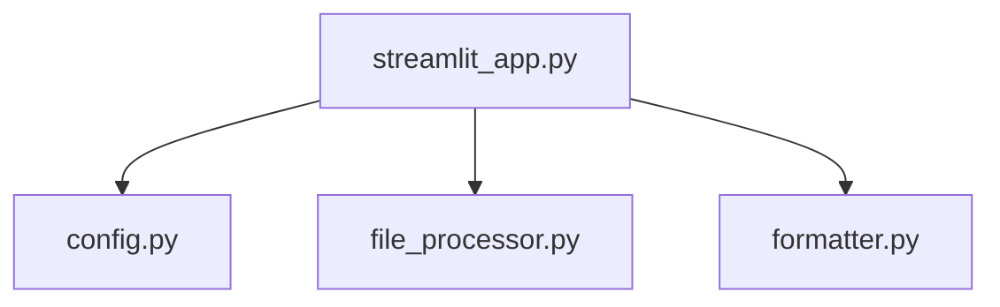

# Code2Prompt 🚀

**Code2Prompt** is a modern, web-based tool that transforms an entire codebase (e.g., Next.js, Python, or similar projects) into a structured, prompt-optimized format designed for language models like ChatGPT. Leveraging a Streamlit app for a sleek, user-friendly experience while maintaining modular, best-practice code organization, Code2Prompt is your go-to tool for prompt engineering.

---

## Table of Contents 📚

- [Code2Prompt 🚀](#code2prompt-)
  - [Table of Contents 📚](#table-of-contents-)
  - [Features ✨](#features-)
  - [Project Structure 🗂️](#project-structure-️)
  - [Installation 🔧](#installation-)
  - [Usage 🚀](#usage-)
  - [Screenshots 📸](#screenshots-)
  - [Mermaid Diagram](#mermaid-diagram)
  - [Contributing 🤝](#contributing-)
  - [License 📄](#license-)
  - [Author 👨‍💻](#author-)
  - [How to Cite 📝](#how-to-cite-)

---

## Features ✨

- **Streamlit Web Interface:** Upload ZIP files and configure settings through an interactive sidebar.
- **Customizable Ignore Settings:** Easily select which directories/files to ignore (e.g., `node_modules`, `.git`, etc.).
- **Multiple Output Formats:** Generate prompts in **Plaintext**, **Markdown**, or **XML**.
- **Optimized for LLMs:** Structured file boundaries and language hints improve clarity.
- **Performance Enhancements:** Utilizes caching and progress feedback for faster processing.
- **Modular Design:** Clean, modular codebase following best practices with comprehensive documentation.

---

## Project Structure 🗂️



- **config.py:** Contains default configuration settings and ignore directories.
- **file_processor.py:** Handles extraction of ZIP files and retrieval of file paths.
- **formatter.py:** Formats file content into optimized prompts (Plaintext, Markdown, XML).
- **streamlit_app.py:** Main entry point for the Streamlit app.

---

## Installation 🔧

1. **Clone the Repository:**

   ```bash
   git clone https://github.com/yourusername/Code2Prompt.git
   cd Code2Prompt
   ```

2. **Create a Virtual Environment:**

   ```bash
   python -m venv venv
   source venv/bin/activate  # On Windows: venv\Scripts\activate
   ```

3. **Install Dependencies:**

   ```bash
   pip install -r requirements.txt
   ```

4. **Format Code (Optional):**

   Use [Black](https://black.readthedocs.io/) to format the code:

   ```bash
   black .
   ```

---

## Usage 🚀

1. **Run the Application:**

   ```bash
   streamlit run streamlit_app.py
   ```

2. **Using the App:**
   - **Upload a ZIP File:** Click the file uploader to select your ZIP file.
   - **Configure Settings:** Use the sidebar to select directories to ignore and choose your desired output format.
   - **Generate Prompt:** Click the "Generate Prompt" button to process your file.
   - **Review & Copy:** The generated prompt is displayed in the text area. Optionally, view a file tree preview.

---

## Screenshots 📸

_Include screenshots or GIFs of the app here to showcase the modern UI._


---

## Mermaid Diagram

Below is a diagram representing the project structure:


---

## Contributing 🤝

Contributions are welcome! Please fork the repository and submit a pull request with your changes. For major changes, open an issue first to discuss your ideas.

---

## License 📄

This project is licensed under the MIT License. See the [LICENSE](LICENSE) file for details.

---

## Author 👨‍💻

**Bjorn Melin** - [GitHub Profile](https://github.com/BjornMelin)

---

## How to Cite 📝

If you use Code2Prompt in your research or project, please cite it using the following BibTeX entry:

```bibtex
@software{melin2025code2prompt,
  author       = {Bjorn Melin},
  title        = {Code2Prompt: A Streamlit Tool for Codebase-to-Prompt Conversion},
  year         = {2025},
  publisher    = {GitHub},
  journal      = {GitHub repository},
  howpublished = {\url{https://github.com/BjornMelin/Code2Prompt}}
}
```

---

Enjoy using **Code2Prompt** to supercharge your prompt engineering and optimize your AI interactions! 🎉
